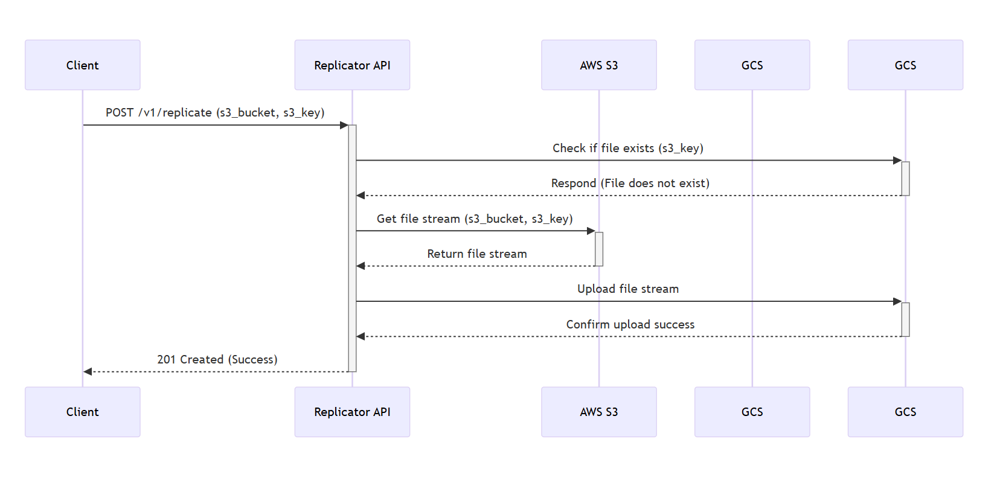

# Cross-Cloud Storage Replicator

This project is a Python-based API service that replicates files from an AWS S3 bucket to a Google Cloud Storage (GCS) bucket. It is designed to be event-driven, robust, and memory-efficient.

---
## Sequence Diagram

The following diagram illustrates the workflow of a replication request.

---
Key Features
Event-Driven: Exposes a simple HTTP POST endpoint to trigger the replication process on demand.

Memory-Efficient: Uses streaming to transfer files directly from S3 to GCS without saving them to the local disk, allowing it to handle large files with a small memory footprint.

Idempotent: The service checks if a file already exists at the destination before starting the transfer. If it does, the operation is skipped to prevent duplicate work.

Secure: All cloud credentials and configuration are managed securely through environment variables, with no hardcoded secrets in the codebase.

Design Choices
Framework: Flask was chosen as the web framework due to its lightweight nature and simplicity, making it ideal for building a single-purpose API endpoint.

Cloud SDKs: The official Python SDKs, Boto3 for AWS and google-cloud-storage for GCP, were used for reliable and robust interaction with the cloud storage services.

Error Handling: The application includes specific error handling for common issues, such as a file not being found in the source S3 bucket (404 Not Found), and returns appropriate HTTP status codes and error messages.

Setup and Running Instructions
1. Prerequisites
Python
An AWS account with an S3 bucket and IAM user credentials.
A Google Cloud Platform account with a GCS bucket and a Service Account JSON key.

2. Installation
Clone the repository and install the required dependencies.

git clone <your-repository-url>

cd <repository-name>

python -m venv venv

source venv/bin/activate

pip install -r requirements.txt

3. Configuration
Create a .env file in the root of the project directory and add the following environment variables:

# AWS Credentials
AWS_ACCESS_KEY_ID=YOUR_AWS_ACCESS_KEY_ID
AWS_SECRET_ACCESS_KEY=YOUR_AWS_SECRET_ACCESS_KEY

# Google Cloud Credentials
Use the full path to your downloaded service account JSON key

GOOGLE_APPLICATION_CREDENTIALS=/path/to/your/gcp-service-account-key.json

# Target GCS Bucket
GCS_BUCKET_NAME=your-target-gcs-bucket-name

4. Running the Service
Start the Flask development server with the following command:

flask run

The service will be available at http://127.0.0.1:5000.

5. Testing the Endpoint
You can test the replication endpoint by sending a POST request using curl. Make sure you have a file uploaded to your source S3 bucket.

curl -X POST \
  http://127.0.0.1:5000/v1/replicate \
  -H "Content-Type: application/json" \
  -d '{
        "s3_bucket": "your-source-s3-bucket-name",
        "s3_key": "name-of-your-file.txt"
      }'

A successful replication will return a 201 Created status code, while a skipped replication (due to the file already existing) will return a 200 OK status code.
